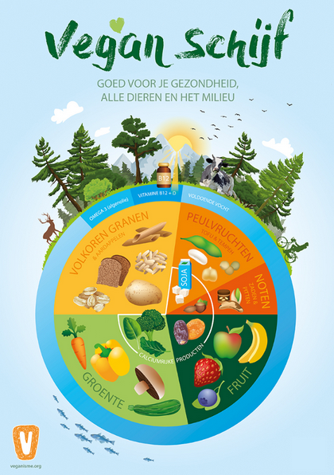

Following is the script of the "How to eat vegan healthily" youtube video with the references to all claims we make. As much as possible we've only used scientific literature or sources of respected and generally accepted to be reliable organizations and made sure they always back up their claims with scientific literature.

SCRIPT
[Foreshadowing the video]

In this video we will show you how you can have a perfectly healthy plantbased diet based on the current scientific consensus. [Source that claims this is possible for all stages of life: https://pubmed.ncbi.nlm.nih.gov/27886704/]

If you do eat or want to eat more plantbased, be sure to watch until the end, as although it is very possible; there are clear examples of vegan diets which are not healthy [Source that shows vegans who don't supplement B12 are at higher healthy risk: https://www.mdpi.com/2072-6643/11/12/3019]

We're basing this entire video on scientific literature and you can find a link to all our references in the description! We've ensured our sources are independent (without ulterior motive), basing their information on papers published in scientific journals.

[The main organizations we have used:
- https://www.voedingscentrum.nl/nl/service/vraag-en-antwoord/gezonde-voeding-en-voedingsstoffen/hoe-kan-ik-gezond-veganistisch-eten-.aspx
- https://www.nlm.nih.gov/
- https://www.veganisme.org/informatie/voeding/
- https://academic.oup.com/ajcn/article/89/5/1627S/4596952
- https://www.medicalnewstoday.com/articles/149636#benefits
- https://www.who.int/
- https://www.nhs.uk
]

And now... Let's get concrete and simple.

....

[Translated and taken from https://www.nieuwsvoordietisten.nl/nieuw-de-vegan-schijf/]

Let me introduce to you the vegan pizza. It has 5 slices and a crust. Each of these sections represents one categorie of foods, like fruits and vegetables. The consensus is that if you eat a certain amount of each of these categories each day and vary within those catefories you will get all the nutritients you need. [Dutch source explaining how to eat vegan: https://www.voedingscentrum.nl/nl/service/vraag-en-antwoord/gezonde-voeding-en-voedingsstoffen/hoe-kan-ik-gezond-veganistisch-eten-.aspx]

This vegan pizza was created by a team of dietitians working with the Dutch Society for Veganism [Source: https://www.nieuwsvoordietisten.nl/nieuw-de-vegan-schijf/]. The size of each slice represents how much grams is recommended to take relative to each other. 

[TODO explain each sections (listing by showing many products within thaqt section) and then increasing a nutrients bar proportionally]

Let's start with the biggest sectionn: The vegetables. The recommended amount is at least 250 to 300 grams a day [https://www.veganisme.org/informatie/voeding/]

Then the second biggest section is the wholemeal grains (and potatoes). This includes rice, potatoes, wholemeal bread, wholemeal pasta. Being a good source for certain nutrients it is also partly how you get your complete proteins from plants!

Which brings us to the next sections. Legumes! This includes peas, tofu, tempeh, chicpeas and all beans. Legumes are a great source of many essential nutrients PLUS lgeumes combined with a wholemeal grain can be considered to make a complete protein [Source that claims this https://www.voedingscentrum.nl/nl/service/vraag-en-antwoord/gezonde-voeding-en-voedingsstoffen/waarom-hebben-vegetariers-en-veganisten-meer-eiwit-nodig-.aspx]

For example
- wholemeal bread with hummus
- Brown rice with beans
- Wholemeal pasta with chicpeas

And where are those vegetables from earlier?

"This all is actually a really good dinner!"

Then our next section is fruit. The recommended amount is at least 2 to 3 pieces of fruit every day [https://www.veganisme.org/informatie/voeding/]. Or combined with vegetables at least 5 portions (so for example 250 grams of vegetables and 2 pieces of fruit) [https://www.nhs.uk/live-well/eat-well/how-to-eat-a-balanced-diet/the-vegan-diet/]

Then our next slice is nuts, pips and seads. Eventhough peanuts are technically a legume, nutrionally they are also a part of this sections. So peanutbutter, flaxseeds, walnuts, sesame seeds. Recommended is to at least include a handul of nuts a day and once a week some more [https://www.voedingscentrum.nl/nl/service/vraag-en-antwoord/gezonde-voeding-en-voedingsstoffen/hoe-kan-ik-gezond-veganistisch-eten-.aspx]

Here are all nutritients and things you might consider wanting to take into account into your diet. Here are the nutritients of which the current consensus claims you should keep an eye on. [include source]

If you eat the sections of the vegan pizza and vary, this is all the nutritients that you'll have sufficient amounts of. We see Iodine, Calcium, B12, D and Omega 3 DHA and EPA and water left over.

For your Iodine make sure to either eat bread with iodized salt, or seaweed, or iodized table salt. 

For your calcium we've included an inner section in the vegan pizza for calcium rich products. So be sure to also include them in your diet. Calciumrich products include - green, leafy vegetables such as broccoli, cabbage and okra, but not spinach (spinach does contain high levels of calcium but the body cannot digest it all)
- sesame seeds and tahini
- dried fruit, such as raisins, prunes, figs and dried apricots
- calcium-set tofu
- It is also often added to fortified foods to replace the animal-product. (CHECK THIS)
[https://www.nhs.uk/live-well/eat-well/how-to-eat-a-balanced-diet/the-vegan-diet/]

For the remaining nutritients we go to the crust of the vegan pizza which represents what you consume through water. So water and supplements. The current scientific consensus recommends supplementing B12, D and omega 3.
